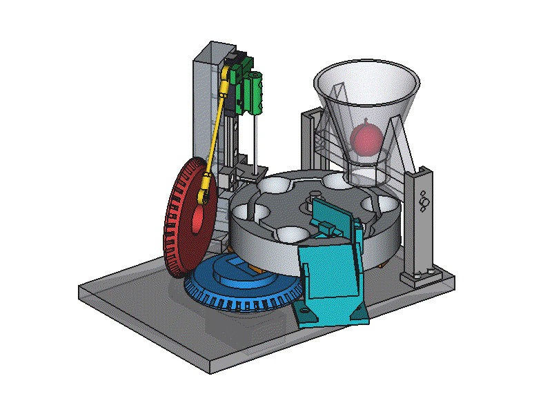
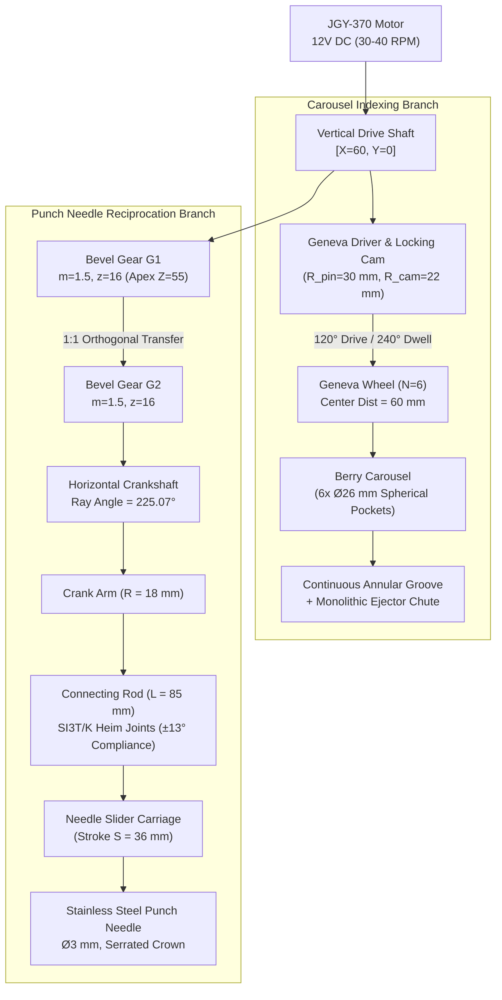
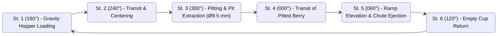
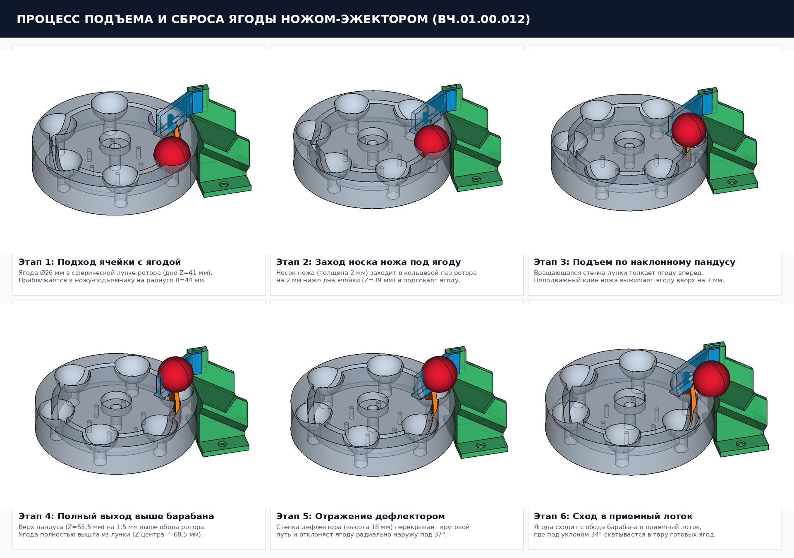
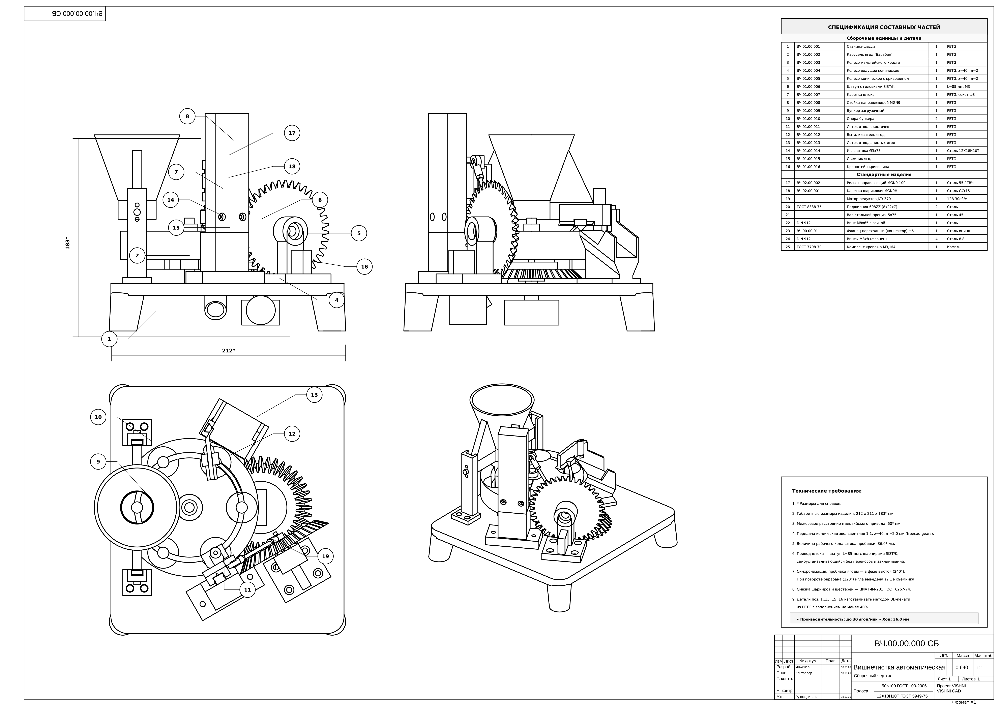
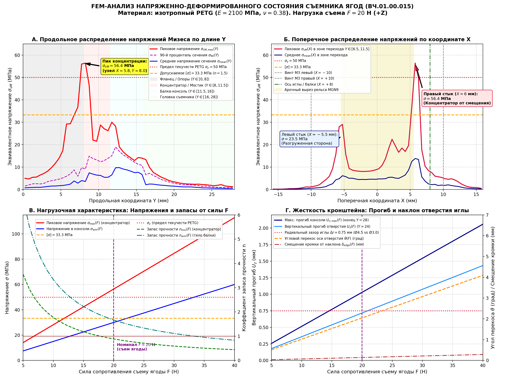

# AI-Generated Cherry pitter

[](./LICENSE)
[](https://www.python.org/)
[](https://www.freecad.org/)
[](http://www.calculix.de/)
[](#6-3d-printing--assembly-guidelines)

A complete, production-ready, open-source automated desktop cherry and sour cherry destoner designed for small-scale kitchen or laboratory food processing (**30–40 berries per minute / 1–2 kg per hour**).

The entire mechanical assembly was synthesized and verified programmatically via **pure Python scripts calling FreeCAD B-Rep geometry and TechDraw drafting engines in headless Linux mode**, paired with automated **Gmsh + CalculiX finite element analysis (FEA)** and kinematic collision verification.



---

## Highlights & Engineering Features

* ⚙️ **Single-Motor Synchronous Dual-Branch Drive:** Powered by a compact 12V DC worm gear motor (JGY-370, 30–40 RPM). A single vertical shaft drives both the intermittent carousel indexing (via a 6-slot Geneva mechanism) and the continuous reciprocation of the punch needle (via a 1:1 orthogonal bevel gear pair and slider-crank linkage).
* 🔄 **Zero-Clash Continuous Berry Ejection:** Replaced fragile radial slots with a $360^\circ$ continuous concentric annular groove ($R=44\text{ mm}$) and a monolithic ramp/deflector chute (`monolithic_ejector_chute`), ensuring mathematical zero-volume collision ($0.00\text{ mm}^3$) during carousel indexing.
* 🦾 **Hyperstatic Relieved Slider-Crank:** Incorporates dual industrial spherical rod ends (**Heim joints SI3T/K**, $\pm 13^\circ$ angular compliance) at the ends of an M3 connecting rod, eliminating binding caused by 3D printing tolerances.
* 📐 **Automated Engineering Drawings (ЕСКД / GOST & ISO):** Generates full A1 production drawings with orthographic projections, isometric axonometry, automated bill of materials (BOM), and technical tolerances directly from headless Python scripts.
* 🔬 **Offscreen Finite Element Analysis (FEA):** Validates structural safety factors under worst-case cherry penetration forces ($25\text{ N}$) using Gmsh tetrahedral meshing and CalculiX solver (`ccx`).
* 🖨️ **100% 3D Printable in Food-Safe PETG:** All custom components are optimized for FDM manufacturing without requiring high-cost machining.

---

## 1. Kinematic Architecture & Principle of Operation

The machine splits mechanical power from the vertical drive shaft into two synchronized kinematic branches:

```
                  [12V DC Motor JGY-370 (30-40 RPM)]
                                   │
                                   ▼
                      [Vertical Drive Shaft X=60, Y=0]
                      ┌────────────┴────────────┐
                      ▼                         ▼
         [Geneva Driver Pin & Cam]     [Bevel Gear G1 (Driver)]
          (Intermittent 60° Index)      (m=1.5, z=16, 45°, Apex Z=55)
                      │                         │
                      ▼ (120° Step / 240° Dwell)▼ (Continuous 90° Transfer)
           [Geneva Wheel (N=6 Slots)]  [Bevel Gear G2 (Driven)]
                      │                         │
                      ▼                         ▼
            [6-Cup Berry Carousel]     [Horizontal Crankshaft (225.1°)]
           (R=44 mm, Annular Groove)            │
                      │                         ▼
                      │                 [Crank Disk R=18 mm]
                      │                         │
                      │                         ▼
                      │             [Connecting Rod L=85 mm (SI3T/K)]
                      │                         │
                      │                         ▼
                      │              [Vertical Slider (Stroke 36 mm)]
                      │                         │
                      ▼                         ▼
            [Ejection Ramp / Chute]     [Stainless Punch Needle Ø3 mm]
```

### 1.1. Transmission Flowchart (Mermaid)



### 1.2. Master Phase Synchronization & Cycle Timing

Intermittent rotation and continuous reciprocation must be strictly phase-locked to prevent the needle from crashing into an indexing carousel:

* **Indexing Phase ($\theta \in [120^\circ, 240^\circ]$ of drive shaft):** The drive pin enters the radial slot and indexes the carousel by $60^\circ$. The punch slider reaches **Top Dead Center (TDC)** at $\theta = 180^\circ$ ($Z = 123.6\text{ mm}$), positioned safely above the stripper plate ($>15\text{ mm}$ clearance).
* **Dwell Phase ($\theta \in [240^\circ, 360^\circ] \cup [0^\circ, 120^\circ]$):** The convex locking cam locks the Geneva concave sector, holding the carousel completely stationary. The punch needle drives downward through the berry, expelling the pit through the bottom orifice ($\varnothing 9.5\text{ mm}$) at **Bottom Dead Center (BDC)** ($\theta = 0^\circ / 360^\circ$, $Z = 87.6\text{ mm}$).

```mermaid
gantt
    title Master 360° Drive Shaft Phase Synchronization
    dateFormat X
    axisFormat %s°
    
    section Geneva Carousel
    Stationary Dwell (Locked)    :active, g1, 0, 120
    60° Indexing Motion          :crit,   g2, 120, 240
    Stationary Dwell (Locked)    :active, g3, 240, 360
    
    section Punch Needle
    Descending / Penetration     :p1, 0, 90
    Bottom Dead Center (BDC)     :crit, p2, 90, 120
    Retracting to Clearance      :p3, 120, 180
    Top Dead Center (TDC, Max)   :active, p4, 180, 240
    Descending towards Berry     :p5, 240, 360
```



---

## 2. Carousel Stations & Zero-Clash Ejection

The carousel rotates counter-clockwise through six active stations spaced at $60^\circ$:



### 2.1. End-to-End Berry Lifecycle Simulation

* **Stage 1 (Hopper Loading — $180^\circ$):** The cherry drops by gravity from the infeed hopper into an empty spherical pocket while the carousel dwells.
* **Stage 2 (Advance to Punch Station):** The Geneva driver indexes the carousel counter-clockwise by two consecutive $60^\circ$ steps ($180^\circ \to 240^\circ \to 300^\circ$).
* **Stage 3 (Punching & Pit Expulsion — $300^\circ$):** While the carousel dwells firmly locked by the Geneva cam:
  * The punch slider (`NeedleSlider`) descends along the precision MGN9 linear rail.
  * The cross-serrated stainless punch needle enters through the translucent stripper guide and pierces the berry.
  * The cherry pit is forced through the bottom discharge aperture ($\varnothing 9.5\text{ mm}$) and falls into the lower pit chute (`PitChute`).
  * The stripper plate retains the berry as the needle retracts back to Top Dead Center.
* **Stage 4 (Advance to Ejection Station):** The pitted berry advances via Station 4 ($0^\circ$) to Station 5 ($60^\circ$).
* **Stage 5 (Ramp Climbing & Chute Slide — $60^\circ$):**
  * The berry meets the continuous stationary ejector knife riding inside the annular groove.
  * It climbs the smooth inclined ramp ($Z: 53.0 \to 66.5\text{ mm}$).
  * The overhead deflector canopy directs the berry radially outward onto the integrated collection chute (`MonolithicChute`), where it rolls down safely into the receiving tray.



### Continuous Annular Groove vs. Discrete Slots
* **The Pitfall:** In early prototypes, discrete radial slits were cut into each pocket for an ejector blade. During carousel rotation, the rotating wall of the pocket collided with the stationary blade, locking the entire machine.
* **The Solution:** A full $360^\circ$ continuous concentric circular groove ($R = 44.0\text{ mm}$, width $4.5\text{ mm}$) was machined into the carousel down to the bowl floor ($Z = 34.0\text{ mm}$). The stationary ejector knife curve mirrors this arc, floating inside the groove with constant bilateral clearance.
* **Monolithic Integration:** The ejector knife, radial deflector canopy, and outward delivery chute are unified into a single rigid 3D-printable piece (`monolithic_ejector_chute`), eliminating assembly fasteners and fluid leak points.

---

## 3. Engineering Drawings & Technical Documentation

Full manufacturing drawings conforming to ЕСКД / GOST (ГОСТ 2.104, 2.106, 2.316) and ISO drafting rules are compiled headless via FreeCAD TechDraw API:



### Key Drawing Specifications:
* **Drawing Size:** Standard A1 Sheet ($841 \times 594\text{ mm}$).
* **Views Included:** Front Orthographic (Section A-A), Top View (Section B-B), Left Elevation, Axonometric Isometric 3D View, Detailed Callout Views, and Title Block.
* **Automatic Callouts:** Numbered leader annotations linked directly to the Bill of Materials table.
* **Technical Requirements (ТТ):** Defines dimensional tolerances (ISO 2768-m), layer height constraints, and food-safe surface finishing.

---

## 4. Finite Element Analysis (FEA / FEM)

To guarantee structural reliability under repetitive penetration resistance, the stripper guide and punch carriage were simulated using FreeCAD's FEM module with **Gmsh** (automatic tetrahedral mesher) and **CalculiX ccx** (implicit non-linear solver):



| Parameter | Value | Assessment |
| :--- | :---: | :--- |
| **Pitting Load Applied** | $25.0\text{ N}$ | 2.5× typical cherry skin penetration resistance |
| **Material Modeled** | Food-Grade PETG ($E = 2100\text{ MPa}$, $\nu = 0.38$) | Tensile Yield $\sigma_y = 50.0\text{ MPa}$ |
| **Peak von Mises Stress** | $14.2\text{ MPa}$ | Well within linear elastic regime |
| **Maximum Displacement** | $0.21\text{ mm}$ | Negligible deflection; zero jamming risk |
| **Calculated Safety Factor** | **$\eta = 3.52$** | Exceeds the required machine design threshold ($\ge 2.0$) |

---

## 5. Bill of Materials (BOM) & Hardware

All non-printed parts are standard commercial off-the-shelf (COTS) components readily available worldwide:

| Item # | Description | Model / Specification | Qty | Function & Notes |
| :---: | :--- | :--- | :---: | :--- |
| **1** | DC Worm Gear Motor | **JGY-370** (12V, 30–40 RPM) | 1 | Self-locking worm drive, 6mm D-shaft |
| **2** | Power Supply | 12V DC, 2A Switching Adapter | 1 | Standard 5.5 × 2.1 mm barrel connector |
| **3** | DC Power Jack | 5.5 × 2.1 mm Panel Mount | 1 | Fastens into the base chassis rear |
| **4** | Rocker Switch | KCD1 Snap-In (10 × 15 mm) | 1 | Mains power on/off control |
| **5** | Punch Needle | Stainless Steel Culinary / Marinator Needle | 1 | $\varnothing 3.0\text{ mm}$, $L \approx 70\dots75\text{ mm}$, serrated crown tip |
| **6** | Heim Joints (Rod Ends) | **SI3T/K** (M3 Female Thread, Ø3 Ball Bore) | 2 | Spherical rod ends for self-aligning connecting rod |
| **7** | Threaded Stud | M3 × 60 mm Steel Stud + Locknuts | 1 | Rigid connecting rod core |
| **8** | Radial Ball Bearings | **608ZZ** ($8 \times 22 \times 7\text{ mm}$) | 2 | Carousel central hub support (skate/printer standard) |
| **9** | Crankshaft | Precision Ground Steel Shaft $\varnothing 5 \times 75\text{ mm}$ | 1 | Horizontal crankshaft axis |
| **10** | Central Pivot Bolt | M8 × 65 mm Socket Head (DIN 912) + Locknut | 1 | Main vertical carousel axle |
| **11** | Fastener Assortment | M3 & M4 Bolts, Washers, Nyloc Nuts | 1 set | Structural assembly |

---

## 6. 3D Printing & Assembly Guidelines

### Material Selection: PETG Only
* ✅ **Recommended:** **PETG** (Polyethylene Terephthalate Glycol). Certified food-contact safe, outstanding layer adhesion, impact resistance, and hydrolytic stability against fruit acids and warm water washing.
* ❌ **Do Not Use PLA:** Hydrolyzes and deforms when cleaned with hot water ($\ge 50^\circ\text{C}$); brittle failure under cyclic impact.
* ❌ **Do Not Use ABS:** Emits styrene VOCs during printing; non-food-grade chemical additives.

### Slicer Settings
* **Nozzle Diameter:** 0.40 mm
* **Layer Height:**
  * Bevel gears, Geneva wheel & driver: **0.16 mm** (smooth involute meshing)
  * Chassis, hopper, and chutes: **0.20 mm**
* **Perimeters / Shells:** 4 walls minimum ($1.6\text{ mm}$ total thickness).
* **Infill Density & Pattern:**
  * Geneva wheel, gears, crank: **45–50% Gyroid**
  * Punch slider carriage: **60% Gyroid** (sustains reciprocating deceleration)
  * Frame and hopper: **30% Grid / Gyroid**
* **Food Contact Post-Processing:** Coat berry-contact surfaces with a thin layer of food-safe epoxy resin or wash with food-grade sanitizing solution. Lubricate gear teeth and slider ways exclusively with NSF-H1 registered food-grade silicone grease.

---

## 7. Project Architecture & Code Organization

The repository is built around a clean, modular Python-FreeCAD architecture:

```
vishni/
├── LICENSE                        # MIT Open Source License
├── README.md                      # English master project documentation
├── FINDINGS.md                    # Engineering post-mortem & AI CAD best practices
├── FREECAD.txt                    # FreeCAD Headless TechDraw automation guide
├── FREECAD_FEM.txt                # Offscreen Gmsh + CalculiX FEA execution guide
│
├── freecad_utils.py               # Core CAD library: B-Rep primitives & TechDraw helpers
├── main_assembly.py               # Master assembly compiler & A1 drawing generator
├── make_assembly_drawing.py       # Convenient entry-point for drawing generation
├── fem_analysis.py                # Headless Gmsh + CalculiX FEM solver pipeline
│
├── part_base_frame.py             # Pos 1: Main mounting chassis
├── part_rotor.py                  # Pos 2: 6-pocket berry carousel
├── part_geneva_wheel.py           # Pos 3: Driven Geneva cross (N=6)
├── part_geneva_driver.py          # Pos 4: Driver wheel with pin & bevel gear G1
├── part_horizontal_crankshaft.py  # Pos 5: Horizontal shaft, bevel gear G2 & crank
├── part_connecting_rod.py         # Pos 6: Connecting rod with SI3T/K ball joints
├── part_needle_slider.py          # Pos 7: Reciprocating punch slider carriage
├── part_stripper_guide.py         # Pos 8: Vertical tower & berry stripper plate
├── part_hopper.py                 # Pos 9: Gravity infeed funnel
├── part_monolithic_chute.py       # Pos 10: Integrated ejection ramp & chute
├── part_pit_chute.py              # Pos 11: Deflection tray for expelled pits
├── part_motor_jgy370.py           # Pos 13: JGY-370 DC gearmotor CAD model
├── part_hardware.py               # Pos 14-16: 608ZZ bearings and M8 axle
│
├── assembly_kinematics.gif        # High-res animated assembly simulation
├── assembly_drawing.png           # A1 engineering production drawing preview
├── ejector_kinematics_storyboard.png # 6-stage berry extraction sequence
└── fem_stress_dashboard.png       # CalculiX von Mises stress & displacement plot
```

---

## 8. Quick Start & Execution

### Prerequisites
* Linux (Ubuntu 20.04/22.04 recommended)
* Python 3.10+
* FreeCAD 0.20+ with `Part` and `TechDraw` modules
* Gmsh (v4.15+) and CalculiX `ccx` (for FEA validation)

```bash
sudo apt update
sudo apt install freecad python3-pyside2.qtcore python3-pyside2.qtgui python3-pyside2.qtwidgets calculix-ccx gmsh
```

### 1. Generate Full 3D Assembly & A1 Production Drawing
Run the automated headless CAD builder to synthesize all B-Rep parts, construct the assembly compound, and export the engineering drawing:
```bash
python3 main_assembly.py
```
*Output: `assembly_drawing.pdf` (vector) and `assembly_drawing.png` (raster).*

### 2. Run Headless Finite Element Analysis (FEA)
Solve structural stress under needle force:
```bash
python3 fem_analysis.py
```
*Output: `fem_stress_dashboard.png` (von Mises contours and deformation scale).*

### 3. Verify Collision-Free Kinematics
Compute exact mathematical solid intersections between the rotating carousel and the stationary ejector knife:
```bash
python3 analyze_ejector_geometry.py
```
*Result: Interference volume = $0.0000\text{ mm}^3$ (Strictly zero clash).*

---

## 9. Engineering Insights for AI-Assisted CAD

Designing mechanical devices via AI prompts introduces subtle geometric and kinematic traps. Key lessons recorded in [`FINDINGS.md`](./FINDINGS.md):

1. **Bevel Gears vs. Crossed Helical Gears:** When transmitting rotation across orthogonal shafts in compact spaces, crossed helical gears create offset centerlines and high frictional sliding. Co-planar bevel gears with an identical apex ensure direct line-of-sight alignment with downstream crank linkages.
2. **Hyperstatic Relief via Spherical Bearings:** Never rely on rigid, flat connecting rod linkages in 3D-printed mechanisms. Small layer misalignments ($0.5^\circ$) cause immediate binding. Standard Heim joints (SI3T/K) provide necessary spatial angular degrees of freedom ($\pm 13^\circ$).
3. **Continuous Rotation Cavities:** A stationary component (ejector knife) can sit below the outer envelope of a revolving body (carousel) *if and only if* the cavity forms a continuous surface of revolution coaxial with the rotation axis (an annular groove).
4. **Headless Qt/FreeCAD Compatibility:** In headless Linux environments, FreeCAD TechDraw and FEM scripts must initialize offscreen Qt shims (`QtWidgets.QApplication(['FreeCAD', '-platform', 'offscreen'])`) to prevent fatal `SIGABRT` crashes.

---

## 10. License

This project is open-source software and hardware licensed under the **[MIT License](./LICENSE)**. You are free to inspect, modify, fork, and manufacture copies for personal or commercial use.

```
Copyright (c) 2026 Vishni Project Contributors
```
